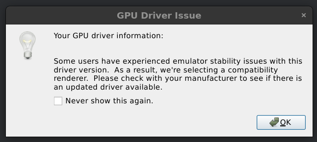

# instalar android estudio en debian 12

https://www.youtube.com/watch?v=K7a4599c9cI

********************************************************
                   Comands used in this video:
********************************************************

tar -xvzf android*.gz

mv android-studio /opt/

gedit /usr/share/applications/android-studio.desktop

*********************************************************
                                Desktop file's content:
*********************************************************
[Desktop Entry]
Encoding=UTF-8
Version=1.0
Type=Application
Name=Android Studio
Exec="/opt/android-studio/bin/studio.sh" %f
Icon=/opt/android-studio/bin/studio.png
Categories=Development;IDE;
Terminal=false
StartupNotify=true
StartuoWMClass=android-studio
Name[en_GB]=android-studio.desktop

# gpu configuración linux

https://developer.android.com/studio/run/emulator-acceleration#vm-linux

