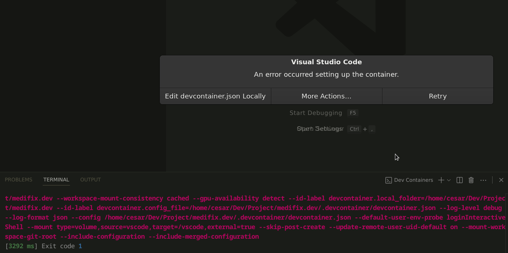

# usar **devcontainers en VS Code** junto con **Docker** y eventualmente **Cloudflare Containers** 
>te da un entorno **limpio, reproducible y seguro**, ideal para tu flujo de trabajo con Go.

requisito previo (`docker pull node:22-alpine`).
Ahora te guío paso a paso desde ahí, integrando **VS Code Dev Containers** → **Docker local** → **Cloudflare**.

---

## 🧭 1. Requisitos previos

Asegúrate de tener instalado y funcionando:

```bash
docker --version
```

Y en VS Code, instala las extensiones:

* ✅ **Dev Containers** (`ms-vscode-remote.remote-containers`)
* ✅ (opcional) **Docker** (`ms-azuretools.vscode-docker`)

---

## 🧩 2. Crear un entorno de desarrollo con DevContainer

En tu proyecto (por ejemplo uno de Go), crea una carpeta `.devcontainer` con estos archivos:

### 📄 `.devcontainer/devcontainer.json`

```json
{
  "name": "Go + Node Dev Environment",
  "image": "node:22-bookworm",
  "features": {
    "ghcr.io/devcontainers/features/go:1": {
      "version": "1.22"
    }
  },
  "customizations": {
    "vscode": {
      "extensions": [
        "golang.go",
        "esbenp.prettier-vscode"
      ]
    }
  },
  "mounts": [
    "source=${localWorkspaceFolder},target=/workspace,type=bind"
  ],
  "remoteUser": "node"
}
```

👉 Esto hace que tu entorno contenga:

* Node.js 22 (de la imagen base).
* Go 1.22 (gracias a `features` de Dev Containers).
* Tus archivos locales montados en `/workspace`.
* Sin ensuciar Debian: todo vive en el contenedor.

---

## 🚀 3. Abrir el entorno en VS Code

En VS Code:

1. Abre tu carpeta del proyecto.
2. Pulsa `Ctrl+Shift+P` → **Dev Containers: Reopen in Container**.
3. VS Code construirá el contenedor con tu configuración.

Listo: tendrás **Node + Go + npm** listos para usar en un entorno aislado.

## si ocurre error de setting:


>Ese error de “Exit code 1” al crear el Dev Container es bastante común cuando se usa una imagen base ligera (como node:22-alpine) y se agregan features de DevContainers (como Go), porque Alpine no tiene las herramientas necesarias (bash, sudo, apt, etc.), y eso rompe el proceso de inicialización. Solución rápida (recomendada)Usa una imagen base de Node.js basada en Debian, en lugar de node:22-alpine.

Puedes comprobarlo dentro del terminal del contenedor:

```bash
node -v
go version
```

---

## ☁️ 4. Integrar con Cloudflare Containers

Ahora, siguiendo la guía oficial que mencionas:
👉 [https://developers.cloudflare.com/containers/get-started/](https://developers.cloudflare.com/containers/get-started/)

Cloudflare Containers permite desplegar contenedores directamente en su infraestructura (similar a Fly.io o Railway).

Una vez tengas tu entorno DevContainer listo y probado localmente, el flujo es:

### a) Iniciar sesión en Cloudflare

```bash
cloudflared login
```

*(o usando la CLI `wrangler` si trabajas con Cloudflare Workers/Containers).*

### b) Construir tu imagen Docker

Desde tu proyecto Go:

```bash
docker build -t miapp-go .
```

### c) Probar localmente

```bash
docker run -p 8080:8080 miapp-go
```

### d) Publicar en Cloudflare

Cloudflare ofrece integración mediante:

* `cloudflared` (para tunel seguro o despliegue directo),
* o un `Dockerfile` + configuración YAML (`cloudflare.yml` o `wrangler.toml`) dependiendo del entorno.

---

## 🧱 Ejemplo de Dockerfile (para tu proyecto Go)

```Dockerfile
FROM golang:1.22-alpine AS build
WORKDIR /app
COPY . .
RUN go build -o main .

FROM alpine:latest
WORKDIR /app
COPY --from=build /app/main .
CMD ["./main"]
```

Esto genera una imagen ligera lista para subir a Cloudflare.

---

## 🪜 Próximos pasos recomendados

1. ✅ Tener Docker y Dev Containers funcionando (ya casi lo tienes).
2. 🔧 Crear tu `.devcontainer/devcontainer.json` y probarlo en VS Code.
3. 🧰 Crear un `Dockerfile` para tu proyecto Go.
4. ☁️ Seguir la guía de Cloudflare para subir y ejecutar tu contenedor.

---


