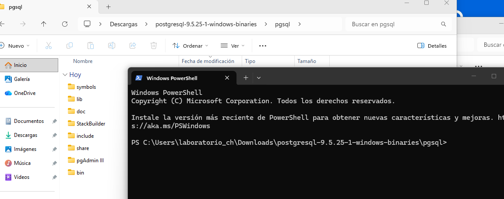
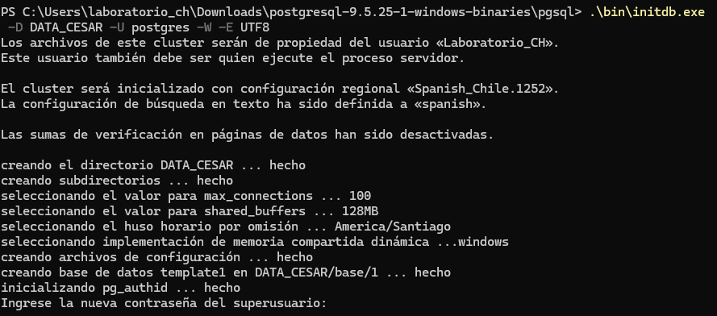
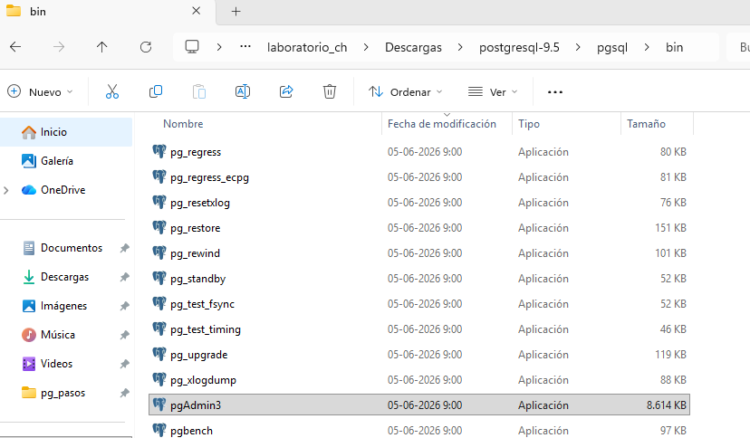
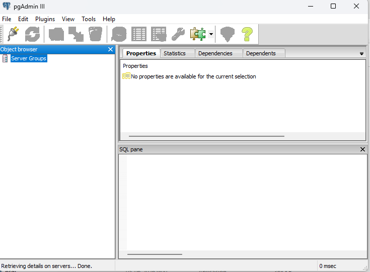
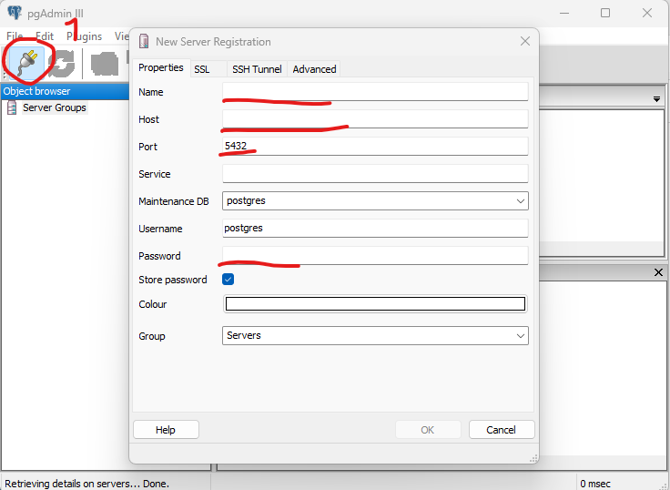
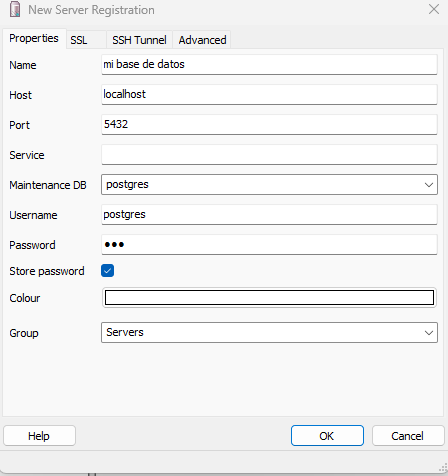
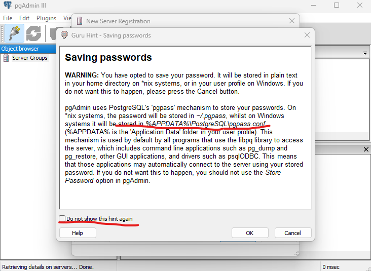
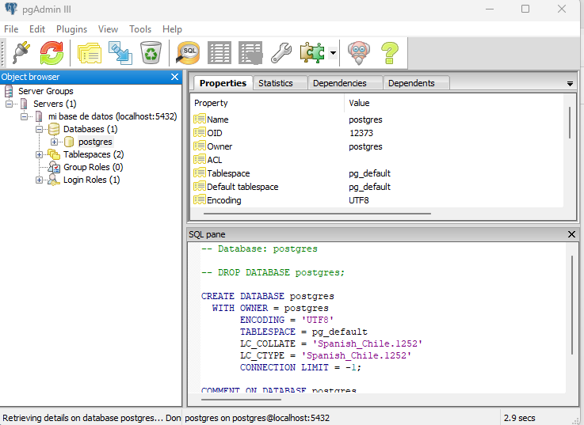

# Pasos  instalacion Postgres 9.5 en Windows

## Paso 1 
  descargar postgres desde https://www.enterprisedb.com/download-postgresql-binaries
  

## Paso 2  
 

## Paso 3 inicar postgres

1. Crear el clúster de datos:

```powershell
.\bin\initdb.exe -D data -U postgres -W -E UTF8
```



2. Iniciar el servidor:

```powershell
.\bin\pg_ctl.exe -D data -l logfile start
```

3. Verificar que está funcionando:

```powershell
.\bin\pg_isready.exe
```

4. Conectarse:

```powershell
.\bin\psql.exe -U postgres
```

o

```powershell
.\bin\psql.exe -h localhost -U postgres
```

### Verifica la versión

También conviene revisar qué versión descargaste:

```powershell
.\bin\postgres.exe --version
```

## 5- ejecutar pg admin 


## 6- pgadmin3


## 7- conexion


## 8- formulario 


## 9- advertencia


## 10- finalizacion 



