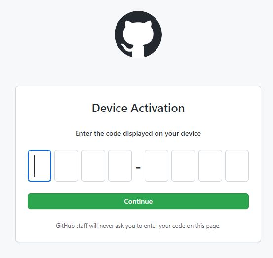
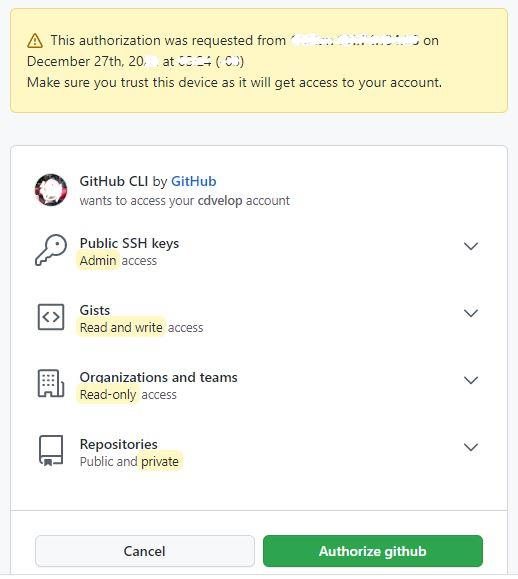
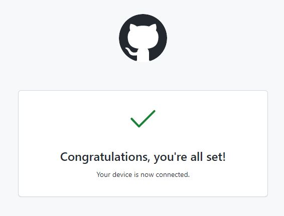

# GitHub CLI

[Pagina descarga cli.github.com](https://cli.github.com/)


[](https://www.youtube.com/watch?v=BsWGjeUTmUc)
_el video muestra la configuración es a traves del protocolo **https**
los pasos a continuación son a traves de ssh:_

1. Después de la instalación nos dirigimos a nuestra consola bash, powershell o cmd y nos [autenticamos](https://cli.github.com/manual/)
    > `gh auth login`

2. Nos preguntara que tipo de cuenta tenemos seleccionamos **>Github.com** enter.
```
What account do you want to log into?
> GitHub.com
  GitHub Enterprise Server
```

3. nos pregunta que tipo de protocolo de comunicación preferimos el mas común es https o si tienes configurado ssh
```
What is your preferred protocol for Git operations?
  HTTPS
> SSH
```

4. seleccionamos nuestra llave de conexión ssh [nombres admitidos: _id_rsa.pub, id_ecdsa.pub y id_ed25519.pub_](https://docs.github.com/es/authentication/connecting-to-github-with-ssh/checking-for-existing-ssh-keys "fuente docs.github.com")
```
Upload your SSH public key to your GitHub account?  
  C:\yo\.ssh\otra_llave.pub
> C:\yo\.ssh\id_rsa.pub
  Skip
```

5. escribimos un nombre para la conexión ssh si no estamos de acuerdo con la propuesta, enter
```
Title for your SSH key: (GitHub CLI)
```

6. nos pregunta como deseamos autenticarnos
```
? How would you like to authenticate GitHub CLI?
> Login with a web browser
  Paste an authentication token
```

7. enseguida nos muestra un código (xxxx-xxxx) el cual escribiremos en el navegador presionemos enter nuevamente
```
! First copy your one-time code: xxxx-xxxx
Press Enter to open github.com in your browser...
```
8. se despliegan las siguientes paginas en su navegador


_escriba su código aquí_

_autorice el cli_

_OK_


9. nuestra salida de la consola sera algo asi
```
✓ Authentication complete.
- gh config set -h github.com git_protocol ssh
✓ Configured git protocol
HTTP 422: Validation Failed (https://api.github.com/user/keys)
key is already in use
```

>El HTTP 422 Validación Failed ocurre cuando se intenta cargar clave pública ssh (id_rsa.pub) nuevamente en su cuenta de GitHub, pero esta ya está cargada.

