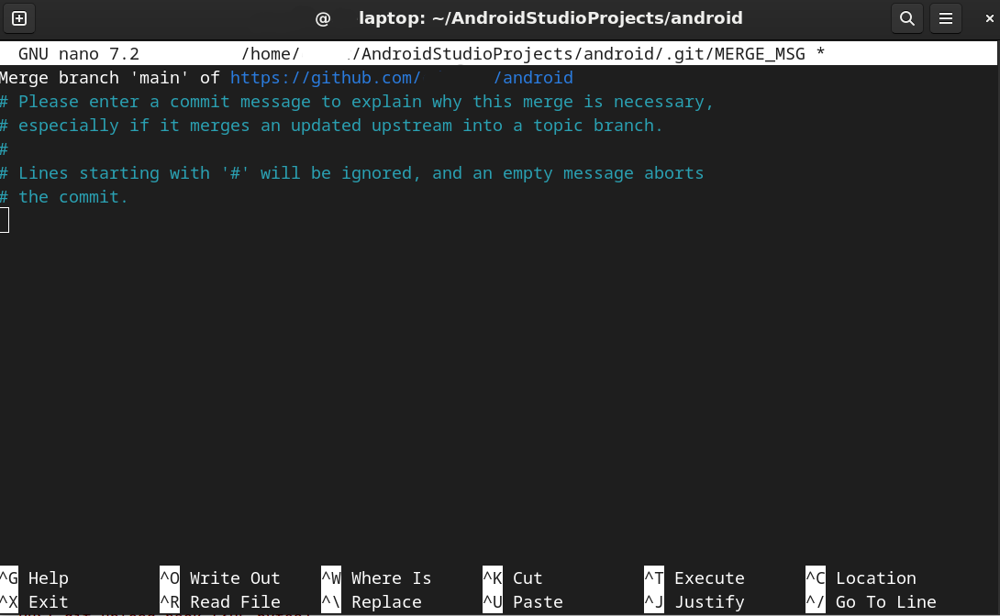

# Branches 
_(Ramas)_

### crear una nueva rama al proyecto
`git branch new_feature`

### cambiarnos a la nueva rama
`git checkout new_feature`

### ver ramas
`git branch`

### ver ramas locales y remotas
`git branch -a`

### agregar cambios rama nueva al remoto
```bash
git add -A
git commit -m "nueva rama"
git push -u origin new_feature
```


## Unir rama new_feature a master

1. nos cambiamos a master
    - `git checkout master`

2. verificamos que tenemos ultima versión
    - `git pull origin master`
    #### - ver ramas unidas anteriormente
    - `git branch --merged`

3. meter cambios rama new_feature a master
    - `git merge new_feature `

4. subir cambios a repo remoto
    - `git push origin master `

5. borrar rama new_feature remoto
    - `git push origin --delete new_feature`

6. borrar rama new_feature local
    - `git branch -d new_feature`

## renombrar rama

### 1. **Si ya estás en la rama que quieres renombrar**
Ejecuta lo siguiente en tu terminal:
```sh
git branch -m nuevo-nombre
```
Esto renombrará la rama actual al `nuevo-nombre`.

### 2. **Si NO estás en la rama que quieres renombrar**
Si deseas renombrar otra rama sin cambiar a ella, usa:
```sh
git branch -m antiguo-nombre nuevo-nombre
```

### 3. **Actualizar el branch en el repositorio remoto**
Si la rama ya está en el remoto y quieres reflejar el cambio:
```sh
git push origin -u nuevo-nombre
git push origin --delete antiguo-nombre  # Eliminar la versión anterior en remoto
```

### 4. **Actualizar referencias en otros clones del repositorio**
Si otros han clonado el repositorio, deben ejecutar:
```sh
git fetch origin
git checkout nuevo-nombre
git branch --unset-upstream
git branch -u origin/nuevo-nombre
```

Así, la referencia local se actualizará con la nueva rama en el remoto. 🚀

## ver rama por defecto configurada a nivel global
git config --global init.defaultBranch

>si no aparece nada hay que establecerla
git config --global init.defaultBranch main


## fusionar 2 ramas con diferente inicializacion
```sh
git pull origin main --allow-unrelated-histories
```
### Explicación de --allow-unrelated-histories:
    •Por defecto, Git se niega a fusionar ramas que no comparten un ancestro común porque esto podría ser una señal de que estás intentando fusionar cosas que no deberían estar juntas, lo que podría llevar a un historial desordenado o a la pérdida de trabajo.
    •La bandera --allow-unrelated-histories le dice a Git: "Entiendo que estas historias no están relacionadas, pero quiero fusionarlas de todas formas".
    
### Después de ejecutar este comando:
    
    1.Posibles Conflictos: Es muy probable que tengas conflictos de fusión, especialmente si hay archivos con el mismo nombre en ambos historiales (local y remoto). Git intentará fusionar los archivos, pero si encuentra diferencias en las mismas líneas, marcará los archivos como conflictivos.
    
    2.Resolución de Conflictos: Si aparecen conflictos, tendrás que resolverlos manualmente como te expliqué en la respuesta anterior:
        •Abre los archivos conflictivos.    
        •Busca los marcadores <<<<<<<, =======, >>>>>>>.
        •Edita los archivos para dejar el contenido deseado.•Guarda los archivos.
        •Añade los archivos resueltos: git add . (o git add <nombre_del_archivo>).
        •Crea un commit de fusión: git commit -m "Merge unrelated histories".
    
    3.Push Final: Una vez que la fusión se complete (con o sin resolución de conflictos) y hayas hecho el commit de fusión, deberías poder hacer push de tus cambios:
    ```sh
    git push origin main
    ```
### si te aparece un cuadro de texto


Lo que te salió en pantalla es el **editor de mensajes de commit** (`nano` u otro).
al ejecutar:

```bash
git pull origin main --allow-unrelated-histories
```

Git intentó **fusionar** el historial de tu proyecto local con el del repositorio remoto (porque no comparten el mismo origen), y ahora te pide que escribas un mensaje para el commit de merge.

---

### 🔧 Qué hacer ahora

En `nano` tienes varias opciones:

1. **Aceptar el mensaje por defecto** (lo que aparece arriba: `"Merge branch 'main' of ..."`):

   * Simplemente presiona `Ctrl + O` (para guardar), luego `Enter`, y después `Ctrl + X` (para salir).
   * Esto confirmará el merge.

2. **Personalizar el mensaje**:

   * Puedes escribir algo más descriptivo arriba, por ejemplo:

     ```
     Fusionando proyecto local con repositorio remoto (main)
     ```
   * Luego igual haces `Ctrl + O`, `Enter`, `Ctrl + X`.

3. **Cancelar el merge**:

   * Si decides que no quieres continuar, puedes salir con `Ctrl + X` sin guardar.
   * El merge quedará abortado y tu repo volverá al estado previo.

---

### ⚡ Recomendación

Como es la primera unión de dos historiales distintos, puedes aceptar el mensaje por defecto.
Después de salir de `nano`, Git completará el **commit de merge**, y tendrás ya tu rama `main` sincronizada (aunque puede que haya conflictos a resolver si archivos coinciden).

---


