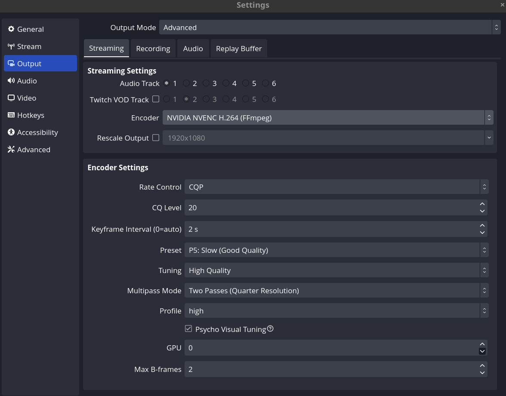

# configuracion OBS

## streaming

## Análisis de Hardware y Configuración

**Hardware de la Laptop:**
- **CPU**: Intel Core i7-11800H (11ª Gen) - 8 núcleos / 16 hilos
- **GPU**: NVIDIA GeForce RTX 3060 Mobile
- **RAM**: 16 GB

**¿Es esta configuración ideal para tu laptop?**
**Sí, es la configuración óptima.** Aquí está la justificación detallada:

1. **Codificador NVIDIA NVENC H.264**: Esta es la decisión más importante. Tu RTX 3060 cuenta con un chip dedicado (NVENC de 7ª generación) exclusivo para la compresión de video. Al usar NVENC en lugar de x264 (que usaría tu CPU), liberas al procesador i7 de esta carga pesada. Esto te permite tener un rendimiento alto (altos FPS) en tus videojuegos y cero pérdidas de rendimiento en la PC mientras transmites.
2. **Control de la frecuencia CBR y Tasa de bits de 6000 Kbps**: CBR (Constant Bitrate) es requerido por plataformas como Twitch y YouTube para evitar caídas de cuadros en transmisiones en vivo. 6000 Kbps es la tasa ideal y el límite recomendado generalizado para transmitir fluídamente a 1080p (60fps) o 720p (60fps) asegurando una excelente calidad para la compresión.
3. **Intervalo de fotogramas clave (2s)**: Es el estándar y el requisito técnico exigido por las plataformas de streaming para una reproducción óptima por parte de los espectadores.
4. **Preajuste de Máxima Calidad y Perfil (High)**: Con la potencia de la RTX 3060, tu gráfica puede soportar los preajustes de más alta calidad (como P5/P6 u optimizado a "Calidad/Máxima Calidad") sin que los juegos se saturen. El Perfil `High` asegura la mayor fidelidad gráfica de H.264, haciendo que tu stream luzca nítido.
5. **Psycho Visual Tuning y Max B-Frames**: Estas son optimizaciones avanzadas de la arquitectura de la serie RTX. Mantener los B-Frames en 2 y el "Psycho Visual Tuning" activado ayuda al codificador a redistribuir de manera inteligente la calidad (bitrate) en escenas de mucha acción de tu juego (por ejemplo, en un combate), mejorando cómo se ve el stream cuando hay movimientos bruscos en cámara.

En resumen, esta configuración exprime al máximo tus componentes, utilizando el hardware integrado de tu gráfica (NVENC) creado específicamente para este propósito, lo que permite que tus juegos y la transmisión funcionen de manera estable y simultánea, con calidad profesional.

## Grabación Local (Recording)

**¿Es esta configuración óptima para grabación local?**
**Sí, es absolutamente óptima y altamente recomendada.** Esta configuración aprovecha al máximo el hardware de tu laptop para grabaciones de alta calidad sin comprometer el rendimiento general (FPS) al jugar. Aquí está la justificación detallada:

### Pestaña "Recording" (Ajustes Generales)
1. **Formato de Grabación (mkv)**: ¡Excelente decisión! Si OBS se bloquea, hay un corte de energía, o el sistema falla, el archivo `.mkv` conservará todo lo grabado. Si usas `.mp4` y hay un fallo, el archivo se corromperá irremediablemente. (Nota: Puedes ir a `Ajustes > Avanzado > Grabación` y activar "Convertir automáticamente a mp4 al finalizar la grabación" si requieres editar en Premiere/DaVinci Resolve).
2. **Codificador de Video (NVIDIA NVENC H.264)**: Al igual que en el streaming, delegar esta pesada carga al codificador físico dedicado en tu RTX 3060 Mobile libera por completo a tu procesador i7-11800H de la compresión de video.

### Pestaña "Encoder Settings" (Ajustes del Codificador)
1. **Control de Frecuencia (CQP - Constant Quantization Parameter)**: Esta es la diferencia principal y más importante respecto al streaming (donde se usa CBR). CQP es el estándar de oro para grabación. A diferencia de forzar un bitrate constante, CQP asigna dinámicamente cuanto bitrate sea necesario en cada momento para mantener una calidad visual constante. Si la imagen es estática gastará muy poco, y si hay explosiones asignará más bitrate. Siempre se verá perfecto.
2. **Nivel CQ (20)**: El nivel de CQ varía de 1 (sin pérdidas) a 51 (baja calidad). Un valor de **20** es el "punto dulce" ("Sweet Spot") ideal para resoluciones de 1080p a 60fps. Ofrece una nitidez excelente y una fluidez en la imagen que es visualmente indistinguible de la fuente original, a la vez que mantiene los tamaños de los archivos de video bastante razonables para tu disco duro.
3. **Preajuste (P5: Slow - Good Quality)**: Con la potencia bruta de tu RTX 3060, el nivel P5 procesará los cuadros y escenas otorgando mucha calidad sin saturar el Encoder NVENC, lo cual previene lag o "stuttering" en tu video final.
4. **Multipass Mode y Psycho Visual Tuning**: Ambas opciones combinadas exprimen características avanzadas exclusivas de las tarjetas RTX, logrando un re-análisis en tiempo real rápido (a un cuarto de resolución) para luego asignar detalles con mayor nitidez a áreas complejas y escenas de movimientos brucos en tus videojuegos.

En conclusión, para una laptop con un i7-11800H y una RTX 3060, esta configuración en base a **CQP 20 con el chip NVENC activado es profesional, segura (MKV) y definitivamente la más óptima** para guardar tus partidas o videos tutoriales con altísima calidad sin comprometer los frames del juego original.

## Audio y Bitrate

Al grabar o transmitir un **curso**, el componente más importante es el audio (la voz del instructor). Aquí está la justificación sobre el bitrate adecuado para este propósito:

**¿Es suficiente 128 kbps o se recomienda 160 kbps para un curso?**

Para un curso donde la claridad de la voz es fundamental, **se recomienda encarecidamente usar 160 kbps (o superior)**.

**Justificación:**

1. **La regla de los 128 kbps**: 128 kbps (AAC) es el estándar aceptable mínimo para audio estéreo. Es suficiente para que se entienda el diálogo y la voz humana general (rango de frecuencias vocales y compresión base), y suele ser de uso general para podcasts en plataformas básicas.
2. **El salto a 160 kbps (o 192 kbps)**: El estándar moderno en plataformas como YouTube es procesar audio a partir de los 160 kbps y 192 kbps. Transmitir o grabar a 160 kbps proporciona:
    - **Mayor rango dinámico**: Beneficia mucho la claridad de las consonantes y las sibilancias naturales de la voz (las letras "S" y "F"), previniendo que el audio del instructor se perciba "encajonado", "metálico" o fatigante de escuchar por horas de estudio.
    - **Mejor mezcla**: Si tu curso incluye una pista sutil de música de fondo, notificaciones de sistema del PC, o efectos de sonido de interfaces; a 128 kbps la música y la voz empezarán a distorsionarse o fusionarse en "barro acústico", ya que el codificador no tiene suficiente ancho de banda para representarlas fielmente a la vez. A 160 kbps, hay margen suficiente.
3. **Costo de rendimiento**: A nivel de "peso del archivo" de video resultante y "uso del procesador", el paso de procesar 128 kbps a 160 kbps (o incluso 320 kbps) de solo audio es completamente **apreciativo y marginal** (literalmente menos de un 1% de impacto). La mejora que tendrás en calidad de escucha a largo plazo compensa abrumadoramente el nulo costo de rendimiento extra.

**Recomendación:** Para cursos y contenido educativo vitalicio, configura el bitrate de la pista 1 (la principal para tu micrófono) a **160 kbps**; o en su defecto a 192 kbps para asegurar audio "transparente" sin artefactos de compresión.

## Replay Buffer (Búfer de Repetición)

El **Replay Buffer (Búfer de Repetición)** es una función de OBS que graba constantemente video y audio en segundo plano (guardándolo temporalmente en la memoria RAM) pero sin guardar un archivo permanente en tu disco duro... hasta que tú presionas una tecla de acceso rápido (hotkey). Cuando presionas esa tecla, OBS guarda en el disco duro los últimos "X" segundos o minutos (los que tú hayas configurado).

Es exactamente el mismo concepto que el sistema de grabación de videoconsolas modernas (como el botón "Share" de PlayStation o "Record that" en Xbox) o software como NVIDIA ShadowPlay.

**¿Deberías usarlo o no?**

La decisión depende estrictamente de **qué tipo de contenido estás creando**.

**Razones para SÍ usarlo:**
- **Creación de "Clips" o "Highlights" (Gaming)**: Si juegas partidas largas de Valorant, Call of Duty o League of Legends pero no quieres grabar 3 horas enteras de video (lo cual ocuparía muchísimo disco duro y sería un dolor de cabeza editar), el Replay Buffer es perfecto. Lo dejas activo, juegas tranquilo, y solo cuando haces una jugada increíble, presionas tu atajo de teclado para guardar los últimos, por ejemplo, 60 segundos.
- **Transmisiones en vivo (Streaming)**: Muchos streamers lo usan para capturar un momento divertido que acaba de ocurrir en stream, guardar el clip en alta calidad (sin depender del sistema de clips limitado de Twitch) y subirlo de inmediato a TikTok, Shorts o Reels.

**Razones para NO usarlo (y dejarlo desactivado como está en tu captura):**
- **Grabación de Cursos o Tutoriales**: Para este tipo de contenido, tú sabes exactamente cuándo empiezas y cuándo terminas de grabar. Necesitas la sesión completa de principio a fin de manera estructurada. Por lo tanto, debes usar la grabación "Estándar" normal (botón "Start Recording") y el Replay Buffer es completamente inútil aquí.
- **Ahorro de Memoria RAM**: Aunque es poco, mantener el Replay Buffer activo significa que OBS está constatemente reservando y escribiendo video en un bloque de tu memoria RAM (en tu captura, configurado a un máximo de 512 MB). Si estás en una situación donde tu laptop está al límite de uso de RAM (15 de 16 GB), apagarlo libera recursos valiosos.

**Conclusión:**
Si tu objetivo principal con OBS es **grabar cursos y tutoriales de programación**, debes **mantener el Replay Buffer DESACTIVADO** (casilla desmarcada, tal cual la tienes). Solo actívalo si algún día decides jugar videojuegos y quieres capturar "momentos épicos" sin grabar horas de video inútil.
