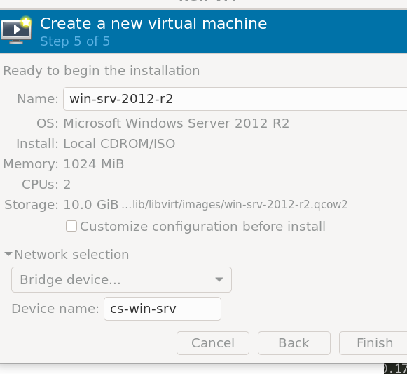
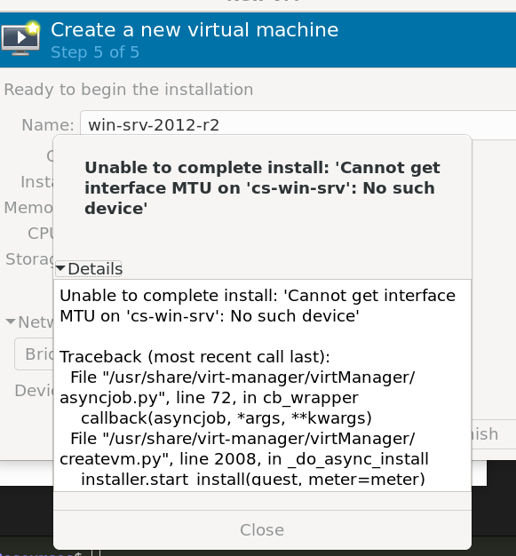

# Red Bridge en KVM/QEMU para comunicación directa con la VM

> Guía paso a paso para novatos en redes Linux

## ¿Por qué usar un bridge?

Cuando creas una máquina virtual (VM) en KVM/QEMU, por defecto la red es tipo NAT: la VM tiene acceso a Internet, pero no es visible desde otros equipos de tu red local. Si quieres que tu VM tenga una IP en tu red local (como cualquier otro PC) y puedas acceder a ella directamente (por ejemplo, por SSH, RDP, HTTP, etc.), necesitas usar una red tipo **bridge**.

---

## 1. ¿Qué es un bridge?
Un bridge (puente) conecta tu VM directamente a la red física de tu casa/oficina. Así, la VM recibe una IP de tu router y es visible para otros dispositivos.

---

## 2. Requisitos previos
- Tener instalado KVM/QEMU y Virt-Manager.
- Tener privilegios de administrador (sudo).
- Saber el nombre de tu interfaz de red física (ejemplo: `eno1`, `eth0`, `wlp2s0`).

---

## 3. Identificar tu interfaz de red física

Abre una terminal y ejecuta:
```bash
ip link
```
Busca la interfaz conectada a tu red (normalmente **NO** es `lo`, `virbr0` ni `docker0`). Ejemplo de salida:
```
2: eno1: <BROADCAST,MULTICAST,UP,LOWER_UP> mtu 1500 ...
```
En este caso, la interfaz es `eno1`.

---

si te parece mucha información, prueba este scrip bash para ver solo las interfaces útiles para bridge, mostrando en verde el nombre, la MAC y el tipo (wifi o ethernet):
```bash
ip -o link | grep -E 'state UP' | grep -Ev 'lo|virbr|docker' | while read -r line; do \
  iface=$(echo $line | awk '{print $2}' | sed 's/://'); \
  mac=$(echo $line | awk '{print $17}'); \
  if [ -d /sys/class/net/$iface/wireless ]; then tipo="wifi"; else tipo="ethernet"; fi; \
  echo -e "\033[1;32m$iface\033[0m  MAC: $mac  Tipo: $tipo"; \
done
```
Esto te mostrará, por ejemplo:
```
eno1  MAC: 7c:57:58:23:d8:86  Tipo: ethernet
wlo1  MAC: e8:fb:1c:b4:5d:c3  Tipo: wifi
```

## 4. Crear un bridge con NetworkManager

### a) Instala bridge-utils (si no lo tienes)
```bash
sudo apt install bridge-utils network-manager
```


### b) Crea el bridge y asígnale la interfaz física
Sustituye `eno1` por el nombre de tu interfaz:

#### Crea una nueva conexión de tipo bridge llamada 'br0'
```bash
sudo nmcli connection add type bridge autoconnect yes con-name br0 ifname br0
```
#### Añade tu interfaz física (por ejemplo, eno1) como esclava del bridge 'br0'
```bash
sudo nmcli connection add type ethernet slave-type bridge autoconnect yes con-name br0-port ifname eno1 master br0
```
#### Activa el bridge 'br0' para que empiece a funcionar
```bash
sudo nmcli connection up br0
```


### c) Desactiva la conexión directa previa de la interfaz física
Antes de activar el bridge, debes asegurarte de que la interfaz física no tenga otra conexión activa directa.

#### Muestra todas las conexiones de red y su tipo/dispositivo
```bash
sudo nmcli connection show
```
Por ejemplo, podrías ver una salida como:
```
NAME      UUID                                  TYPE      DEVICE  
br0       30997542-k6c9-4caa-k494-2ce8aebb1a86  bridge    br0     
redWifi2   b97a9aa7-015a-454b-909e-6b2887d66686  wifi      wlo1    
lo        e4825817-0d60-497e-a132-7a00f8c56988  loopback  lo      
docker0   8a5e6ae3-4ocb-p9d1-bd52-1b4fe3ca6329  bridge    docker0 
virbr0    ff9d91ff-7379-4l09-90b5-f0c21af3f548  bridge    virbr0  
br0-port  783bf54c-fk0a-42d7-85ef-b1341ad292a0  ethernet  --      
redWifi1       d8c7277a-aecc-4087-8ef6-bb3669b7a74a  wifi      --   
```

#### Apaga la conexión anterior de la interfaz física (si aparece con DEVICE distinto de --)
```bash
sudo nmcli connection down <nombre-conexion-anterior>
```
Por ejemplo, si tuvieras una conexión llamada `enp3s0` o similar, la apagarías así:
```bash
sudo nmcli connection down enp3s0
```
En tu caso, si solo ves `br0-port` con DEVICE `--`, ya está lista para usarse en el bridge.

---


## 5. Verifica que el bridge esté activo
```bash
ip a
```
Deberías ver una interfaz `br0` con una IP asignada por tu router.

**Importante:**
Si ves que `br0` aparece en estado `DOWN` y tu interfaz física (por ejemplo, `eno1`) sigue teniendo una IP, significa que la IP no se ha movido correctamente al bridge.

**¿Qué hacer si el bridge está DOWN y sin IP?**
1. Apaga la conexión directa de la interfaz física (por ejemplo, `eno1`):
   ```bash
   sudo nmcli connection down eno1
   ```
   > Si ves el mensaje `Error: 'eno1' is not an active connection.`, significa que ya está desactivada y puedes continuar con el siguiente paso.
2. Vuelve a levantar el bridge:
   ```bash
   sudo nmcli connection up br0
   ```

   salida esperada:
   ```bash
      Connection successfully activated (D-Bus active path: /org/freedesktop/NetworkManager/ActiveConnection/3)
   ```


3. Verifica de nuevo con `ip a`. Ahora la IP debería estar en `br0` y el estado debe ser `UP`.

Esto asegura que el tráfico de red pase por el bridge y tu VM pueda comunicarse correctamente con la red local.

---

### ¿Sigue sin aparecer la IP en `br0` o el bridge está DOWN?

Si después de los pasos anteriores el bridge `br0` sigue en estado DOWN o la IP sigue en la interfaz física (`eno1`), prueba lo siguiente:

1. **Reinicia el bridge:**
   ```bash
   sudo nmcli connection down br0 && sudo nmcli connection up br0
   ```

2. **Asegúrate de que el bridge use DHCP:**
   ```bash
   sudo nmcli connection modify br0 ipv4.method auto
   sudo nmcli connection up br0
   ```

3. **Verifica el estado:**
   ```bash
   ip a
   ```
   Ahora la IP debería estar en `br0` y el estado debe ser `UP`.

4. **Si sigue sin funcionar, reinicia NetworkManager:**
   ```bash
   sudo systemctl restart NetworkManager
   sudo nmcli connection up br0
   ip a
   ```

    > **Nota importante:**
    > Si la IP sigue en la interfaz física (`eno1`) y no en el bridge (`br0` o `nm-bridge`), revisa el nombre de la conexión asociada a `eno1` usando:
    > ```bash
    > sudo nmcli connection show
    > ```
    > Busca en la columna DEVICE la fila con `eno1` (o el nombre de tu interfaz física). Luego apaga esa conexión usando su NOMBRE (no el nombre de la interfaz):
    > ```bash
    > sudo nmcli connection down <NOMBRE-CONEXION-ENO1>
    > ```
    > Después, levanta la conexión del bridge (por ejemplo, `br0`):
    > ```bash
    > sudo nmcli connection up br0
    > ```
    > Así la IP se moverá correctamente al bridge y quedará operativo.

5. **Verifica que el esclavo del bridge (`br0-port`) esté activo:**
   ```bash
   sudo nmcli connection up br0-port
   sudo nmcli connection up br0
   ip a
   ```

6. **Si aún así no funciona:**
   - Revisa los logs de NetworkManager:
     ```bash
     journalctl -u NetworkManager -b -e
     ```
   - Busca mensajes de error relacionados con `br0` o `eno1`.

Estos pasos suelen resolver la mayoría de problemas cuando el bridge no sube o la IP no se mueve correctamente. Si el problema persiste, revisa la configuración de tu router (DHCP) y asegúrate de que no haya conflictos de IP.

---

### Error: "No suitable device found for this connection (device br0 not available because profile is not compatible with device (mismatching interface name))"

Este error ocurre cuando el parámetro `ifname br0` en la creación del bridge causa un conflicto. La solución es borrar el bridge y crearlo sin ese parámetro:

1. **Elimina el bridge y su esclavo:**
   ```bash
   sudo nmcli connection delete br0
   sudo nmcli connection delete br0-port
   ```

2. **Crea el bridge SIN `ifname br0`:**
   ```bash
   sudo nmcli connection add type bridge con-name br0 autoconnect yes
   ```

3. **Agrega la interfaz física como esclava:**
   ```bash
   sudo nmcli connection add type ethernet slave-type bridge con-name br0-port ifname eno1 master br0
   ```

4. **Levanta el bridge:**
   ```bash
   sudo nmcli connection up br0
   ip a
   ```

5. **Si la IP no aparece en `br0`, fuerza DHCP:**
   ```bash
   sudo nmcli connection modify br0 ipv4.method auto
   sudo nmcli connection up br0
   ```

Esto debería solucionar el error y mover la IP correctamente al bridge.


## 6. Usar el bridge en Virt-Manager
- Abre Virt-Manager y crea una nueva VM.
- En el paso de red, selecciona `br0` como interfaz de red (en vez de NAT).
- Completa la creación de la VM.

---

**Ejemplo visual: Configuración del bridge en Virt-Manager**

Al crear o editar una VM en Virt-Manager, en la sección de red puedes seleccionar el bridge `br0` como se muestra en la siguiente imagen:



Si intentas seleccionar un bridge que no existe o no ha sido creado correctamente, Virt-Manager mostrará un error como este:



> **Nota:** Si ves este error, asegúrate de haber creado y activado el bridge siguiendo los pasos anteriores antes de asignarlo a la VM.

---

## 7. Prueba de conectividad
- Inicia la VM y el sistema operativo invitado.
- Desde otro equipo de tu red, haz ping a la IP de la VM.
- Puedes acceder por SSH, RDP, HTTP, etc., según lo que configures en la VM.

---

## 8. Solución de Problemas de Conectividad (Ping y Firewall)

Después de configurar el bridge y asignar la red a tu VM, es posible que te encuentres con problemas de conectividad. El más común es el "ping asimétrico".

### El Problema: Puedo hacer ping desde la VM al Host, pero no del Host a la VM

Este es un síntoma clásico y, en la mayoría de los casos, **la causa es el firewall del sistema operativo invitado (la VM)**, no un problema en el bridge de Linux.

**¿Por qué ocurre?**
Por seguridad, los firewalls (como el de Windows Server) vienen preconfigurados para:
- **Permitir** el tráfico de *respuesta* a conexiones iniciadas desde dentro (la VM puede pinguear al host y recibir respuesta).
- **Bloquear** el tráfico entrante no solicitado, como una petición de ping que se origina en el host.

### Solución Definitiva para Windows / Windows Server

Para solucionarlo de forma permanente y segura, debes crear una regla en el firewall de la VM que permita específicamente las solicitudes de ping (protocolo ICMP).

1.  **Abre PowerShell como Administrador** dentro de tu máquina virtual Windows.

2.  **Crea una regla de firewall para permitir pings entrantes (ICMPv4):**
    ```powershell
    New-NetFirewallRule -DisplayName "Allow ICMPv4-In" -Protocol ICMPv4
    ```
    Este comando crea una regla llamada "Allow ICMPv4-In" que permite a cualquier equipo de la red hacerle ping a tu VM.

3.  **Verifica la conexión:**
    Ahora, desde tu máquina host (Debian), intenta hacer ping a la IP de la VM. Debería responder sin problemas.
    ```bash
    ping ip.de.tu.vm
    ```

> **Tip de diagnóstico rápido:**
> Si quieres confirmar rápidamente que el firewall es el culpable, puedes desactivarlo temporalmente en la VM con el siguiente comando de PowerShell (¡recuerda volver a activarlo después!):
> ```powershell
> # Desactivar temporalmente para probar
> Set-NetFirewallProfile -Profile Domain,Public,Private -Enabled False
> 
> # Volver a activar (¡MUY IMPORTANTE!)
> Set-NetFirewallProfile -Profile Domain,Public,Private -Enabled True
> ```

---

## 9. Errores Comunes y Soluciones

### Error: "Cannot get interface MTU on 'br0': No such device"
- El nombre del bridge no existe o está mal escrito. Verifica con `ip link`.

### Error: La VM no recibe IP
- Asegúrate de que el bridge esté correctamente configurado y conectado a la interfaz física.
- Revisa que tu router tenga DHCP habilitado.

### Error: No aparece el bridge en Virt-Manager
- Reinicia Virt-Manager o el sistema.
- Verifica que el bridge esté activo (`ip a`).

### Error: No tienes Internet en la VM
- Verifica que el bridge esté conectado a la interfaz física que tiene acceso a Internet.

---

## 10. Recursos útiles
- [Documentación oficial de libvirt sobre bridges](https://wiki.libvirt.org/Networking.html)
- [Debian Wiki: Bridge Network Connections](https://wiki.debian.org/BridgeNetworkConnections)

---

**¡Listo! Ahora tu VM puede comunicarse directamente con tu red local como cualquier otro equipo.**

---

> Si encuentras errores nuevos, documenta el mensaje y los pasos que diste para poder buscar una solución específica.
