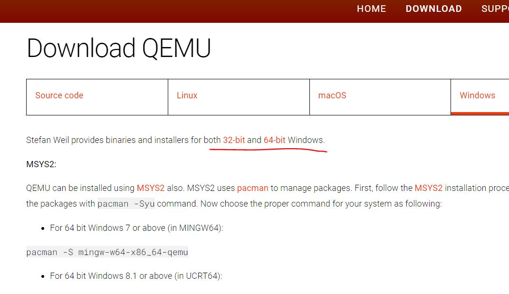
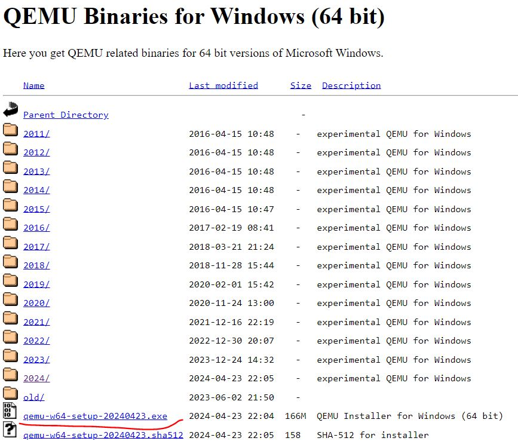
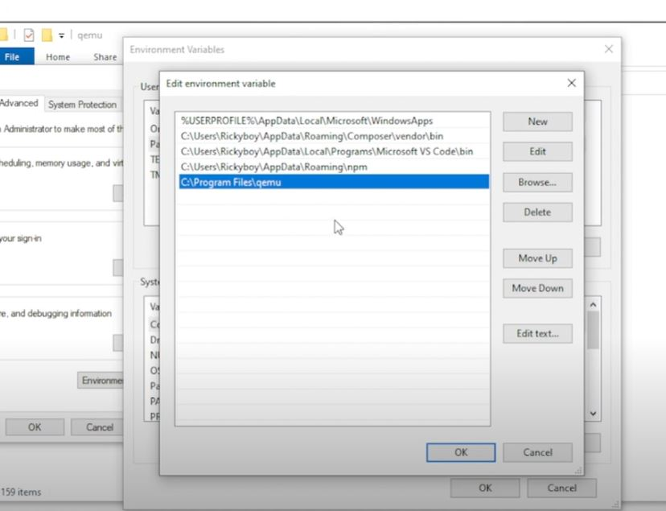
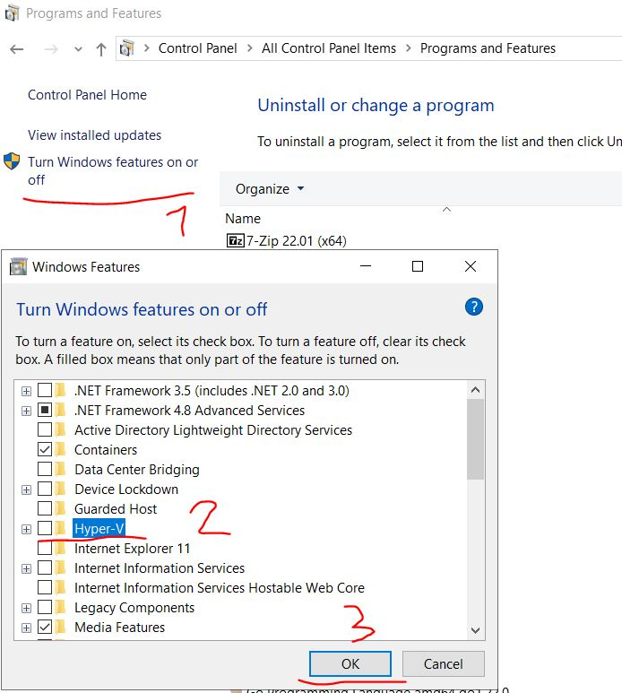
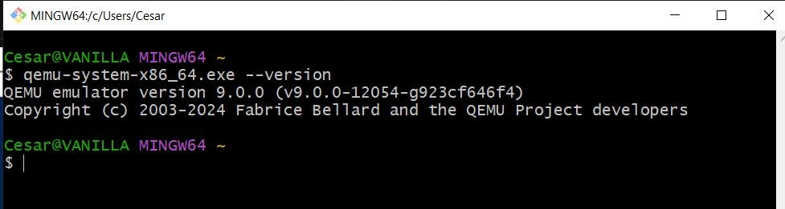
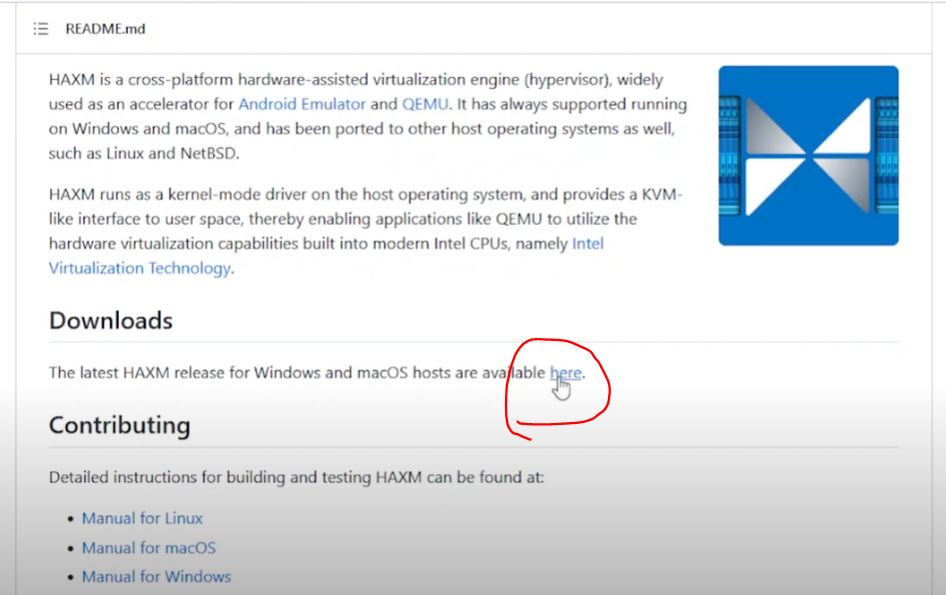
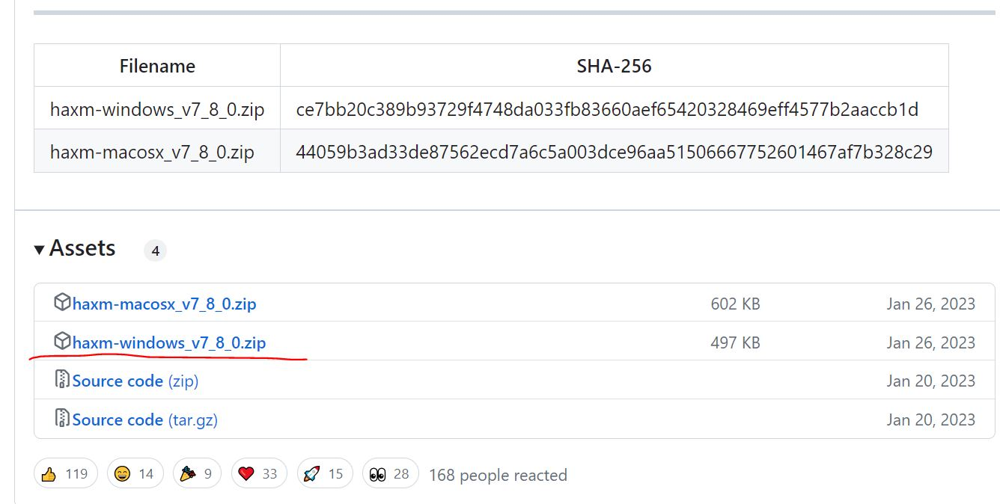
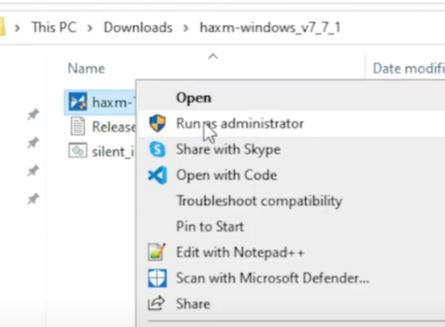
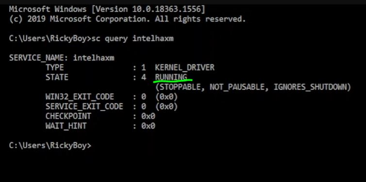

# Instalación QEMU en Windows

1. Descarga el instalador de QEMU desde el sitio web oficial: https://www.qemu.org/download/
 


2. Ejecuta el instalador y sigue las instrucciones.
3. Agrega el directorio de instalación "C:\Program Files\qemu" a la variable de entorno PATH usuario actual.


4. Desactiva Hyper-V en el panel de control de aplicaciones para evitar problemas de compatibilidad.
 reinicia el equipo.

5. verifica en tu consola favorita la versión de QEMU instalada: 
```bash
qemu-system-x86_64.exe --version
```


6. necesitamos descargar el acelerador gráfico intel para QEMU desde https://github.com/intel/haxm



7. descomprima y ejecute como administrador
. instale 

si durante la instalacion aparece este mensaje de advertencia


8. verifique si el servicio esta en ejecución
con el comando 
```bash
sc query intelhaxm
```



